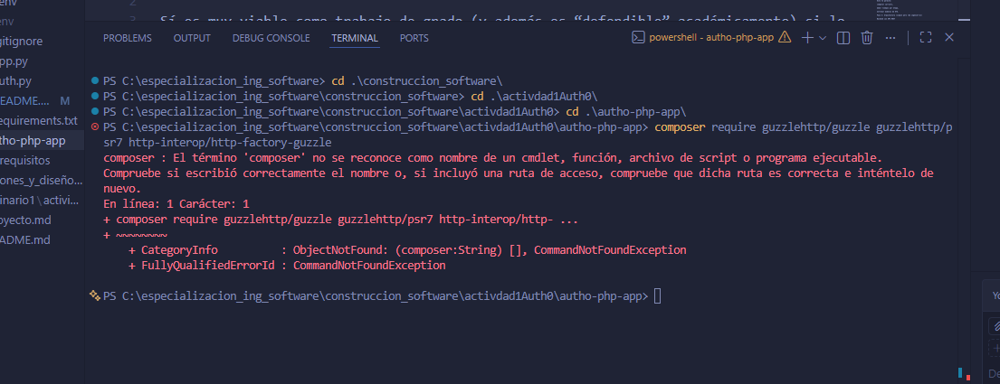

1. Crear la carpeta autho-php-app
2. ejecutar el comando `composer require guzzlehttp/guzzle guzzlehttp/psr7 http-interop/http-factory-guzzle`
- al ejecutar el comando `composer require guzzlehttp/guzzle guzzlehttp/psr7 http-interop/http-factory-guzzle`
me sale el siguiente error:

- composer es el manejador de dependencias de PHP
- instalar composer ir a https://getcomposer.org/download/
3. ejecutar el comando `composer require auth0/auth0-php`
4. crear el archivo `.env` con el siguiente contenido:
```# Your Auth0 application's Client ID
AUTH0_CLIENT_ID={yourClientId}

# The URL of your Auth0 tenant domain
AUTH0_DOMAIN={yourDomain}

# Your Auth0 application's Client Secret
AUTH0_CLIENT_SECRET={yourClientSecret}

# A long, secret value used to encrypt the session cookie.
# This can be generated using `openssl rand -hex 32` from your shell.
AUTH0_COOKIE_SECRET=

# A url your application is accessible from. Update this as appropriate.
AUTH0_BASE_URL=http://127.0.0.1:3000
``` 
# CREAR SSL EN WINDOWS -> ejecutar este comando en powershell 
## en linux es ->  `openssl rand -hex 32` 
$bytes = New-Object byte[] 32
[System.Security.Cryptography.RandomNumberGenerator]::Create().GetBytes($bytes)
($bytes | ForEach-Object { $_.ToString("x2") }) -join ""

5. `composer require vlucas/phpdotenv`
6. crear el archivo `index.php` 
7. `composer require steampixel/simple-php-router`

8. php -S 127.0.0.1:3000 index.php